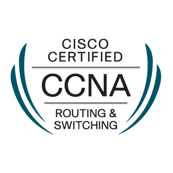
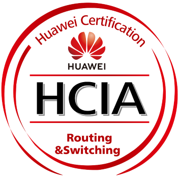
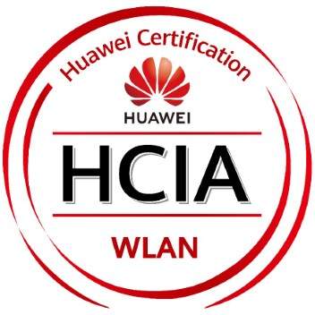
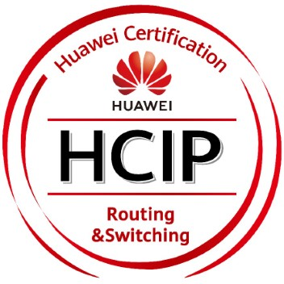
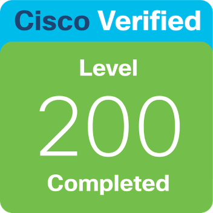

## Links

## Favourite Tools

## Favourite Languages

## Badges

  
Researcher Profiles
<h2></h2>
  
📜 [ORCID](https://orcid.org/0000-0001-7983-462X?lang=en)\
📜 [Scopus](https://www.scopus.com/authid/detail.uri?authorId=56586192200)\
📜 [Science Index](https://www.elibrary.ru/author_items.asp?authorid=746015)\
📜 [Research Gate](https://www.researchgate.net/profile/Lenar-M-Faskhutdinov)\
📜 [Google Scholar](https://scholar.google.com/citations?user=lBr3X9YAAAAJ&hl=ru)\
📜 [Web of Science](https://publons.com/researcher/1907695/lenar-m-faskhutdinov/)

## Competency

